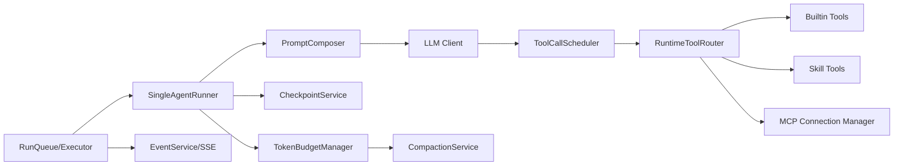

# OpenIntern Agent 能力增强 P0 技术设计与代码改造清单

## 1. 文档目标

本设计文档用于落地 OpenIntern 的 Agent 能力 P0 升级，目标是把当前 `runtime` 主链路升级为“可并行工具编排 + 可注入技能 + 多 MCP 连接 + 可控上下文预算”的单 Agent 内核，缩小与 Codex / OpenCode 在工程任务上的关键差距。

本次只定义 P0：
- 强化单 Agent 闭环能力。
- 不重写现有 multi-role orchestrator 的业务流程。
- 不做 UI 大改（仅补必要的管理入口与调试可视化）。

## 2. 当前基线（2026-02）

当前实际执行链路：
- `src/backend/server.ts` 通过 `createRuntimeExecutor()` 驱动运行时。
- `src/backend/runtime/executor.ts` 负责 run 生命周期、事件落库、SSE 广播。
- `src/backend/runtime/agent-runner.ts` 实现核心 loop（step -> LLM -> tool -> checkpoint）。
- `src/backend/runtime/tool-router.ts` 提供 builtin + MCP 工具路由。
- `src/backend/runtime/skill-registry.ts` 目前主要是“技能元数据目录”，非技能内容注入。

主要限制：
- 工具调用串行执行，缺少并行调度与 mutating gate。
- Prompt 分层薄，缺少模式化提示（plan/max-step/上下文告警）。
- Skill 偏“元数据”，不是可执行 skill package（SKILL.md 注入、依赖约束、显式/隐式触发）。
- MCP 是单客户端模型，缺少多 server 连接管理、resources/templates/read_resource。
- 上下文预算没有自动 compaction/prune 闭环。

## 3. P0 目标与验收标准

### 3.1 能力目标

1. 单回合支持“安全可并行”工具调用编排。
2. 支持 task/subagent 式任务分派（可选子会话复用）。
3. 技能可被发现、查看、注入并被模型正确使用。
4. MCP 支持多服务连接、工具动态刷新、资源读取。
5. 上下文溢出前自动压缩，避免循环失败与硬中断。

### 3.2 量化验收（P0）

- 工具阶段平均耗时下降 >= 30%（读类工具密集任务）。
- 复杂编码任务（读/搜/改/命令/导出）可在单 run 内完成，且无“重复同参工具死循环”。
- Skill load 成功率 >= 99%（本地存在且格式合法）。
- MCP server 部分失败时不拖垮主流程，降级后仍可运行 builtin 工具。
- 出现上下文高水位时自动 compaction，run 不因 `max steps` 直接失败。

## 4. P0 架构设计

核心原则：
- loop 负责“决策与状态”，router 负责“执行与隔离”，scheduler 负责“并发控制”。
- skill 与 mcp 一律工具化，保持模型统一调用界面。
- 所有新增能力必须可事件化、可观测、可测试。

## 5. 模块级技术方案

### 5.1 Agent Loop（`SingleAgentRunner`）

新增能力：
- 统一 step pipeline：`prepare -> call llm -> schedule tools -> checkpoint -> complete`。
- 引入 `ToolCallScheduler` 执行工具批次，而不是 runner 内串行 for-loop。
- 增加“重复同参工具调用熔断”（doom-loop 防护）。
- 增加上下文预算判断，触发自动 compaction。

关键策略：
- 同一批工具调用按 `tool metadata` 分类：`read/inspect` 并行、`write/exec` 串行。
- 工具失败不立即终止 run；默认回传失败结果并交给模型重试决策。
- 仅在不可恢复错误（schema/状态损坏/超硬阈值）时 `run.failed`。

### 5.2 Prompt 分层（新增 `PromptComposer`）

Prompt 层次（从高到低）：
1. 基础系统提示（语言、风格、行为边界）。
2. 模型/Provider 专用补丁（如 OpenAI/Anthropic 差异）。
3. 角色与工具策略（allowed/denied/risk）。
4. 环境上下文（cwd、日期、repo 状态、可用工具摘要）。
5. Skill 注入片段（显式 mention + 允许隐式触发）。
6. Memory 摘要与最近会话摘要。
7. Max-step / 预算告警提示。

### 5.3 Tool Runtime（`ToolCallScheduler + RuntimeToolRouter`）

新增能力：
- 工具元信息：`risk_level`、`mutating`、`supports_parallel`、`timeout_ms`。
- 批量调度：并发上限、超时、取消传播。
- 可选 `batch` 工具（模型显式请求多工具并行）。
- 命令与文件编辑工具补齐：`exec_command`、`write_stdin`、`grep_files`、`glob_files`、`apply_patch`。

执行控制：
- 并行组：只允许 `mutating=false && risk!=high`。
- 串行组：`mutating=true` 或 `risk=high`。
- 审批点：`tool.requires_approval` 事件 + policy 回调（P0 默认可配置 ask/deny）。

### 5.4 Skill Runtime（从元数据到可执行技能）

新增能力：
- Skill 发现：本地目录扫描（repo/user/system）+ 配置路径。
- Skill 装载：读取 `SKILL.md` 正文并注入上下文。
- Skill 依赖：解析可选 `agents/openai.yaml`（工具/环境变量依赖）。
- Skill 工具：`skill_load(name)` 返回技能正文、基路径、采样文件列表。

策略：
- 显式优先：`$skill-name` 或链接形式优先触发。
- 隐式受控：仅 `allow_implicit_invocation=true` 的技能可被自动使用。
- 权限统一：skill 归属工具仍受 `ToolPolicy` 控制。

### 5.5 MCP Runtime（多连接管理）

新增能力：
- `McpConnectionManager` 维护多 server 连接状态。
- 工具聚合命名：`mcp__<server>__<tool>`。
- 支持：`tools/list`、`resources/list`、`resources/templates/list`、`resources/read`。
- 动态刷新：处理工具列表变化事件并增量更新 router。

可靠性：
- 单 server 失败不影响其它 server 与 builtin 工具。
- 每个 server 独立超时、重连退避、健康状态。

### 5.6 上下文预算与自动压缩

新增能力：
- `TokenBudgetManager` 跟踪 prompt/response token 使用趋势。
- 超阈值时触发 `CompactionService`：对旧消息与大工具输出做摘要压缩。
- 输出被压缩的条目标记可追踪元数据，保证可审计。

## 6. 代码改造清单（按文件到函数级）

## 6.1 修改现有文件

### `src/backend/runtime/agent-runner.ts`

- `run(input, ctx)`
  - 接入 `PromptComposer`、`ToolCallScheduler`、`TokenBudgetManager`。
  - 新增 doom-loop 检测与 step 级保护。
- `buildModelMessages(...)`
  - 改为委托 `PromptComposer.compose(...)`。
- `handleToolCalls(...)`
  - 改为调用 `ToolCallScheduler.executeBatch(...)`。
  - 保留事件产出，但新增 `tool.batch.*` 事件。
- `saveCheckpoint(...)`
  - 增加 `budget_state`、`compaction_state`、`last_tool_batch`。
- 新增函数：
  - `maybeCompactContext(...)`
  - `detectRepeatedToolPattern(...)`

### `src/backend/runtime/executor.ts`

- `createRuntimeExecutor(...)`
  - 将 `sharedToolRouter` 升级为“按 scope/mode 缓存的 router manager”。
  - 引入 skill discovery 刷新与 mcp manager 生命周期。
- `refreshSkillRegistry(...)`
  - 改为从 `SkillLoader` 拉取完整技能定义，而非仅 DB 元数据。
- `consumeEventStream(...)`
  - 增加 `tool.batch.*`、`run.compacted` 等事件处理。
- `processEvent(...)`
  - 处理新增事件统计字段，更新 run meta。

### `src/backend/runtime/tool-router.ts`

- `registerBuiltinTools()`
  - 补齐编码工具：`glob_files`、`grep_files`、`exec_command`、`write_stdin`、`apply_patch`、`batch`、`skill_load`。
- `callTool(...)`
  - 支持 `requires_approval` 返回态。
  - 支持从 metadata 判断 mutating/risk。
- `refreshMcpTools()`
  - 改为读取 `McpConnectionManager.listTools()`。
- 新增函数：
  - `listToolMetas()`
  - `callToolsBatch(...)`
  - `listMcpResources(...)`
  - `readMcpResource(...)`

### `src/backend/runtime/tool-policy.ts`

- `check(agent, tool)`
  - 返回三态：`allow | deny | ask`（替代仅 allow/deny）。
  - 支持 pattern 匹配（如 `mcp__github__*`）。
- 新增函数：
  - `evaluateBatchPolicy(...)`
  - `needsApproval(...)`

### `src/backend/runtime/skill-registry.ts`

- `register(...)`
  - 支持 skill source、路径、implicit invocation、依赖元数据。
- `getToolMeta(...)`
  - 增加 `mutating`、`supports_parallel`、`timeout_ms`。
- 新增函数：
  - `registerFromSkillFile(...)`
  - `findByMention(...)`
  - `listImplicitSkills()`

### `src/backend/runtime/skill-repository.ts`

- `create/list/getById` 扩展字段：
  - `source_type`、`entry_path`、`allow_implicit_invocation`、`dependencies`。
- 新增函数：
  - `upsertByPath(...)`
  - `refreshHealth(...)`

### `src/backend/runtime/orchestrator.ts`

- `run(...)`
  - 对 group 场景复用 `ToolCallScheduler`，避免多 role 串行拖慢。
- `runSlot(...)`
  - 增加 tool batch 相关事件透传。

### `src/backend/agent/mcp-client.ts`

- 保留作为低层 transport client。
- 新增/修改：
  - `listResources()`
  - `listResourceTemplates()`
  - `readResource(...)`
  - `subscribeToolsChanged(...)`（若 server 支持）

### `src/backend/server.ts`

- `ServerConfig` 增加：
  - `skills.paths`、`skills.enableImplicit`。
  - `mcp.servers[]`（多 server 配置）。
- `createRuntimeExecutor(...)` 注入新配置。

### `src/types/agent.ts`

- `ToolDefinitionSchema` 增加 metadata：
  - `risk_level`、`mutating`、`supports_parallel`、`timeout_ms`。
- 新增类型：
  - `ToolBatchCall`、`ToolPolicyDecision`、`BudgetState`。

### `src/types/skill.ts`

- `SkillSchema` 增加：
  - `entry_path`、`source_type`、`allow_implicit_invocation`、`dependencies`。

### `src/types/events.ts`

- 新增事件类型：
  - `tool.batch.started`
  - `tool.batch.completed`
  - `run.compacted`
  - `run.warning`
  - `mcp.tools.refreshed`

### `src/backend/db/schema.ts`

- 扩展 `skills` 表字段。
- 新增 `mcp_servers`（可选）与 `mcp_server_state`（可选）表。
- 给 `events` 表增加批量工具与压缩事件索引（若需要）。

### `src/backend/api/skills.ts`

- 新增端点：
  - `POST /api/skills/reload`
  - `POST /api/skills/validate`
  - `POST /api/skills/:id/test-load`

### `src/backend/api/runs.ts`

- `GET /runs/:run_id/events` 支持新事件过滤。
- run meta 增加 `tool_batch_count`、`compaction_count`。

## 6.2 新增文件

### `src/backend/runtime/tool-scheduler.ts`

- `class ToolCallScheduler`
  - `executeBatch(calls, ctx)`
  - `partitionCallsBySafety(calls)`
  - `executeParallelGroup(...)`
  - `executeSerialGroup(...)`

### `src/backend/runtime/prompt-composer.ts`

- `class PromptComposer`
  - `compose(input)`
  - `buildBasePrompt(...)`
  - `buildSkillInjection(...)`
  - `buildBudgetReminder(...)`

### `src/backend/runtime/skill-loader.ts`

- `class SkillLoader`
  - `discover(paths)`
  - `parseSkillFile(path)`
  - `loadSkillContent(skillId)`

### `src/backend/runtime/mcp-connection-manager.ts`

- `class McpConnectionManager`
  - `initialize(servers)`
  - `listTools()`
  - `listResources(server)`
  - `listResourceTemplates(server)`
  - `readResource(server, uri)`
  - `callTool(server, tool, args)`

### `src/backend/runtime/token-budget-manager.ts`

- `class TokenBudgetManager`
  - `update(usage)`
  - `shouldCompact()`
  - `shouldWarn()`

### `src/backend/runtime/compaction-service.ts`

- `class CompactionService`
  - `compactMessages(...)`
  - `compactToolOutputs(...)`
  - `emitCompactionEvent(...)`

## 6.3 可选新增前端管理页（P0 可后置）

### `web/src/pages/SkillsPage.tsx`

- 增加“技能重载 / 校验 / test-load”操作按钮。
- 显示 `allow_implicit_invocation`、`source_type`、`health`。

### `web/src/pages/McpPage.tsx`（新增）

- 展示 MCP server 状态、tools/resources 数量、最后错误。

## 7. 测试改造清单

### 7.1 单测

- `src/backend/runtime/agent-runner.test.ts`
  - 新增并行 tool batch、doom-loop 熔断、budget 触发 compaction 用例。
- `src/backend/runtime/tool-router.test.ts`
  - 新增 batch/approval/mutating gate/mcp resource 用例。
- `src/backend/runtime/skill-registry.test.ts`
  - 新增 skill file 加载、mention 解析、implicit 触发用例。
- `src/backend/runtime/tool-policy.test.ts`
  - 新增 `ask` 三态与 pattern 匹配用例。

### 7.2 协议与集成

- `src/backend/runtime/mcp-tool-router.protocol.test.ts`
  - 扩展 resources/templates/read_resource 与动态 refresh。
- `src/backend/runtime/skill-policy.integration.test.ts`
  - 验证 skill + role policy 组合行为。
- `src/backend/runtime/multi-tenant-isolation.integration.test.ts`
  - 验证多租户下 skill/mcp/router 缓存隔离。

### 7.3 E2E

- `web/e2e/product-features.spec.ts`
  - 覆盖过滤、取消、写黑板、导出 JSON（已存在基础用例，需扩展批量工具与技能注入可观测断言）。
- `web/e2e/chat-trace.spec.ts`
  - 覆盖 `tool.batch.*` 与 `run.compacted` 事件流。

## 8. 实施顺序（建议）

### 阶段 A：Loop + Tool Runtime（必须先做）

- 交付：`tool-scheduler`、`prompt-composer`、runner/executor 改造。
- 风险最低，收益最大（直接提升完成率和速度）。

### 阶段 B：Skill Runtime（第二优先）

- 交付：`skill-loader`、`skill_load` 工具、skills schema/repository 扩展。
- 解决“技能可看可用可执行”主诉。

### 阶段 C：MCP 多连接与资源能力

- 交付：`mcp-connection-manager` 与 router 对接。
- 提升外部工具生态可用性与稳定性。

### 阶段 D：Budget/Compaction 与稳定性收口

- 交付：`token-budget-manager`、`compaction-service`、新增事件与指标。

## 9. DoD（P0 完成定义）

- 单 Agent 支持并行工具批次，且 mutating 工具不并发写。
- skill_load 可将 SKILL.md 注入上下文并被模型成功执行至少 3 个技能场景。
- MCP 多 server 下，任一 server 失败时 builtin 与其它 server 仍可用。
- 上下文高水位触发 compaction 并继续执行，无直接 `max steps` 失败。
- 所有新增核心逻辑有单测 + 协议测试 + 至少 1 个 E2E 覆盖。

## 10. 兼容性与迁移策略

- 保持现有 API 不破坏：新增字段均为可选。
- `src/backend/agent/*` 暂不删除，标记为 legacy；P0 后只维护 `runtime` 主链路。
- Skill 表结构扩展采用 `IF NOT EXISTS` + 默认值，避免线上迁移阻断。

