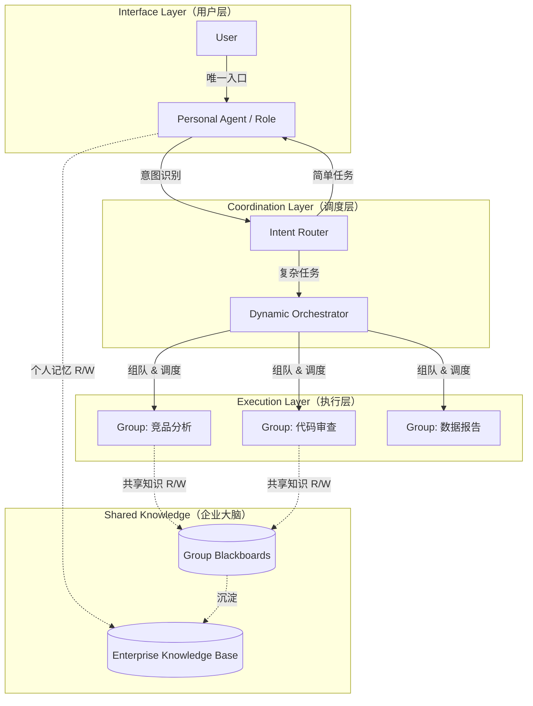

# PA 智能路由架构：从个人助理到企业协作

> 更新时间：2026-02-13
> 状态：RFC（征求意见稿）
> 前置文档：[Orchestrator PRD](../Orchestrator_PRD.md)、[P0 Agent Runtime Design](../P0-agent-runtime-design.md)

---

## 1. 问题陈述

OpenIntern 当前面临的核心架构矛盾：

| 模式 | 优势 | 缺陷 |
|------|------|------|
| 纯个人助理（OpenClaw 模式） | 随叫随到、低门槛、个性化 | 各自为战，无法沉淀企业资产，难以协作 |
| 纯项目/Group 驱动 | 标准化流程、可协作、可审计 | 太重，用户需要理解 Group/Orchestrator 概念才能使用 |

**核心问题**：如何在「个性化/灵活性」与「标准化/协作力」之间找到平衡？

---

## 2. 核心设计原则

> **PA 是入口，Group 是后端服务。**

用户永远只和自己的 PA 对话。PA 是 Group 的「客户」或「发起人」。

类比：

- PA = 员工的专属秘书/接口人（拥有用户的个性化记忆、权限和偏好）
- Group = 为解决特定问题而组建的专家组
- Orchestrator = 专家组的项目经理

---

## 3. 三层架构



### 3.1 Interface Layer（用户层）

- 用户的唯一交互对象是 PA
- PA 的 System Prompt：「服务于 User X，了解 X 的习惯，懂得如何调用后台资源」
- PA 既能调用本地工具（类似 OpenClaw），也能调用企业 API（即 Group）

### 3.2 Coordination Layer（调度层）

- **Intent Router**：PA 内置的意图分类器，判断自己干还是摇人
- **Dynamic Orchestrator**：接收 PA 的请求，负责任务分解（Task Decomposition）和组队（Team Assembly）
- Orchestrator 不直接干活，只做调度

### 3.3 Execution Layer（执行层）

- 专业化 Agent / Group：真正的执行者（Coder, Writer, Researcher...）
- 每个 Group 内部由 SerialOrchestrator 协调多个 Role

---

## 4. 交互流程

### Level 1：简单任务（PA 独立解决）

```
User: "帮我把这份会议纪要整理一下发给张总"
  │
  ▼
PA: 收到 → 调用自己的工具（文档处理、邮件） → 完成
  │
  ▼
User: 收到结果
```

PA 判定标准：任务在自身工具集和能力范围内，无需外部协作。

### Level 2：隐式协作（PA 自动摇人）

```
User: "做一份竞品分析报告，关于产品 A 和竞品 B"
  │
  ▼
PA (Intent Router): "这个需要市场数据 + 技术分析，超出我的能力边界"
  │
  ▼
PA → Orchestrator: "我是 User A 的 PA，需求：竞品分析"
  │
  ▼
Orchestrator: 拉起「搜索专家」+「数据分析」Agent 组成临时 Group
  │
  ▼
Group: 在后台（Blackboard）交换数据、生成报告
  │
  ▼
Orchestrator → PA: "报告完成"
  │
  ▼
PA → User: "这是为您生成的分析报告"
```

用户全程只感知到 PA，Group 工作对用户透明。

### Level 3：高级模式（用户直接介入 Group）

```
User: "我想看看竞品分析 Group 的讨论过程"
  │
  ▼
PA: 生成 Group 频道链接（类似 Slack Channel）
  │
  ▼
User: 进入 Group 详情页，查看/干预讨论
```

仅在用户主动要求时暴露 Group 细节，属于 Power User 功能。

---

## 5. 与现有代码的映射

### 已有基础

| 架构概念 | 现有实现 | 位置 |
|---------|---------|------|
| PA 执行引擎 | `SingleAgentRunner` | `src/backend/runtime/agent-runner.ts` |
| Group 协作 | `SerialOrchestrator` + `Group` + `GroupMember` | `src/backend/runtime/orchestrator.ts` |
| 权限控制 | `ToolPolicy`（allow/deny/ask 三态） | `src/backend/runtime/tool-policy.ts` |
| 知识互联 | `MemoryService` 分层检索 | `src/backend/store/memory-store.ts` |
| 知识沉淀 | `EpisodicGenerator` 自动写 blackboard | `src/backend/runtime/episodic-generator.ts` |
| Role 定义 | `roles` 表 + `RoleRunnerFactory` | `src/types/orchestrator.ts`, `src/backend/runtime/role-runner-factory.ts` |

### 缺失环节

| 能力 | 说明 | 优先级 |
|------|------|--------|
| **Intent Router** | PA 判断自己干还是 escalate 到 Group 的决策逻辑 | P0 |
| **Escalation 机制** | PA 运行中 spawn group run，等结果后继续对话流 | P0 |
| **Result Proxy** | PA 汇总 Group 结果，以用户偏好的风格返回 | P1 |
| **Group 自动匹配** | 根据意图自动选择/创建合适的 Group | P1 |
| **PA 个性化记忆** | 与 Group 记忆分离的用户偏好存储 | P1 |
| **Group 频道直通** | 用户直接查看/干预 Group 讨论的 UI | P2 |

---

## 6. 关键技术挑战

### 6.1 意图识别与路由（Intent Routing）

PA 必须准确判断什么时候自己干、什么时候摇人。

**方案选项**：

| 方案 | 优点 | 缺点 |
|------|------|------|
| A. 基于工具可用性判断 | 简单、确定性高 | 无法处理"工具够但能力不够"的情况 |
| B. LLM 自主判断 + 结构化输出 | 灵活、能理解复杂意图 | 增加一次 LLM 调用，可能误判 |
| C. 混合：规则预筛 + LLM 兜底 | 平衡准确性和成本 | 实现复杂度较高 |

**建议**：先用方案 A（工具边界判断）快速上线，再迭代到方案 C。

**实现思路**：在 `SingleAgentRunner` 中新增 `escalate_to_group` 工具。当 PA 判断需要协作时，调用此工具触发 Group Run，runner 暂停等待结果后继续。

### 6.2 权限透传（Permission Passthrough）

PA 代表用户调用 Group 时，Group 内的 Agent 需要继承用户的权限边界。

```
User (RBAC: finance_read, market_read)
  → PA (继承用户权限)
    → Group Run (权限 = PA 权限 ∩ Role 权限)
      → Agent A (finance_read ∩ researcher_tools)
      → Agent B (market_read ∩ analyst_tools)
```

**实现思路**：在 `run` 表中增加 `delegated_permissions` 字段，Group Run 创建时从 PA 的 run context 继承。`ToolPolicy` 评估时同时检查 role 权限和 delegated 权限。

### 6.3 长短期记忆分离

| 记忆类型 | 归属 | 内容 | 生命周期 |
|---------|------|------|---------|
| 用户偏好 | PA（个人） | 老板喜欢简洁报告、偏好中文 | 长期 |
| 任务状态 | Group（共享） | 项目进度 50%、待解决 3 个 blocker | 随任务 |
| 企业知识 | 全局（共享） | Python 报错解决方案、API 使用规范 | 长期 |

现有 `MemoryService` 已支持 scope 分层（`org_id`, `user_id`, `project_id`, `group_id`, `agent_instance_id`），需要在 PA 场景下明确检索优先级：

```
PA 检索顺序：用户偏好 → 企业知识 → 历史任务记忆
Group 检索顺序：Group Blackboard → 项目知识 → 企业知识
```

---

## 7. 实施路线

### Phase A：Escalation 工具（最小可用）

在 `SingleAgentRunner` 的工具集中新增 `escalate_to_group`：

- PA 调用时传入：`{ goal, context, preferred_group_id? }`
- Runtime 创建子 Group Run，PA 的 run 进入 `waiting` 状态
- Group Run 完成后，结果注入 PA 的对话上下文，PA 继续执行

**交付物**：
- `escalate_to_group` builtin tool
- `run.status` 新增 `waiting` 状态
- `run` 表新增 `parent_run_id` 字段（关联 PA run 和 Group run）

**DoD**：
- PA 在对话中判断需要协作 → 调用 escalate → Group 执行 → 结果回到 PA → PA 回复用户
- 全流程可在 Trace 中回放

### Phase B：智能路由

- PA System Prompt 中注入可用 Group 列表及其能力描述
- PA 基于对话内容自主决定是否 escalate 及选择哪个 Group
- 可选：新增 `list_available_groups` 工具供 PA 查询

### Phase C：权限透传与记忆分离

- `delegated_permissions` 机制
- PA 专属记忆 scope（用户偏好）
- Group 结果自动沉淀到企业知识库

### Phase D：用户直通 Group（Power User）

- UI：从 PA 对话中点击进入 Group 详情
- 用户可在 Group 频道中直接发言/干预
- PA 同步感知用户在 Group 中的操作

---

## 8. 与现有 Orchestrator PRD 的关系

本文档是 [Orchestrator PRD](../Orchestrator_PRD.md) 的上层扩展：

- Orchestrator PRD 定义了 Group 内部的协作机制（Phase 0-4）
- 本文档定义了 **PA 如何触发和消费 Group 的能力**
- 两者互补：Orchestrator 解决"Group 内部怎么协作"，本文档解决"用户怎么无感使用 Group"

```
Orchestrator PRD 范围：
  Group 内部 → Role 调度 → 结构化沟通 → Blackboard → 决策输出

本文档范围：
  User → PA → Intent Router → Escalation → Group（调用 Orchestrator PRD）→ 结果回传 → PA → User
```

---

## 9. 开放问题

1. **Escalation 粒度**：PA 应该 escalate 整个任务，还是可以 escalate 子步骤？（建议先支持整任务，后续迭代子步骤）
2. **Group 复用 vs 临时创建**：PA 应该优先复用已有 Group 还是每次创建临时 Group？（建议优先复用，按 `project_id` + 能力标签匹配）
3. **多 PA 协作**：两个用户的 PA 能否共同发起一个 Group Run？（Phase D+ 考虑）
4. **成本归属**：Group Run 的 token 消耗归属发起的 PA/User 还是 Group 本身？（建议归属发起方）
